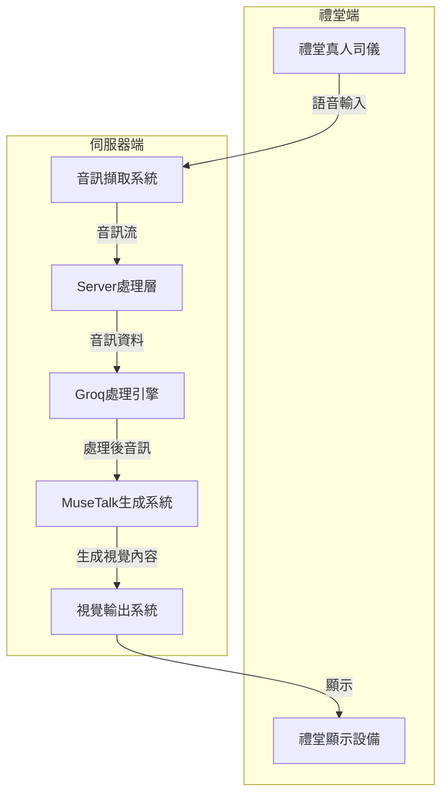
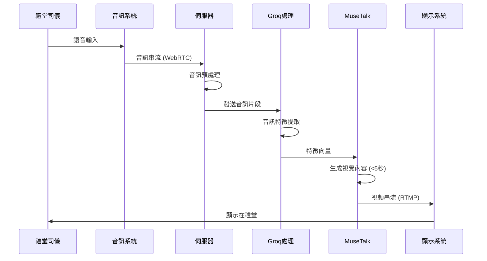

# 架構計畫

## 系統架構概述



## 1. 禮堂傳入真人司儀語音
- **硬體需求**：
  - 高品質麥克風系統
  - 音訊擷取介面（Audio Interface）
  - 低延遲網路連接

- **技術實現**：
  - 使用WebRTC或類似技術實現低延遲音訊串流
  - 建立音訊緩衝機制，確保音訊品質
  - 實時音訊壓縮（如Opus編碼）以優化網路傳輸

## 2. Server接收
- **伺服器配置**：
  - 高性能伺服器，建議配置：
    - CPU: 至少8核心
    - RAM: 至少16GB
    - GPU: NVIDIA RTX系列（用於後續處理）
    - 網路: 高速網路連接，低延遲

- **接收系統**：
  - 建立WebSocket伺服器接收音訊串流
  - 實現音訊解碼和預處理功能
  - 音訊緩衝和同步機制

## 3. Groq轉語音
- **Groq整合**：
  - 使用Groq API進行音訊處理
  - 可能的處理包括：
    - 語音轉文字（STT）
    - 音訊特徵提取
    - 語音增強

- **處理流程**：
  - 將接收到的音訊分段處理
  - 使用Whisper模型（已在MuseTalk中整合）進行特徵提取
  - 優化處理以確保低延遲

## 4. 語音給MuseTalk生成(5秒內)
- **MuseTalk優化**：
  - 基於現有的`realtime_inference.py`進行優化
  - 預先加載和緩存模型和資源
  - 實現流式處理架構

- **性能優化**：
  - 使用半精度(FP16)計算加速推理
  - 批處理優化
  - 使用CUDA核心加速
  - 可能需要模型剪枝或量化以達到5秒內的響應時間

## 5. 生成出的圖像丟回禮堂
- **視覺輸出系統**：
  - 使用WebRTC或RTMP進行視頻串流
  - 實現低延遲視頻編碼（如H.264/H.265）
  - 建立緩衝和同步機制

- **顯示系統**：
  - 禮堂大屏幕顯示系統
  - 可能需要多路輸出以實現不同角度的顯示

## 系統流程圖



## 實施步驟

### 階段一：系統設計與準備
1. **環境設置**
   - 配置伺服器環境
   - 安裝必要的依賴項
   - 下載並準備MuseTalk模型

2. **基礎架構搭建**
   - 設置WebSocket伺服器
   - 配置Groq API連接
   - 建立視頻串流輸出系統

### 階段二：MuseTalk優化
1. **模型優化**
   - 基於`realtime_inference.py`進行優化
   - 實現預加載和緩存機制
   - 優化推理速度

2. **流程優化**
   - 實現流式處理架構
   - 優化批處理大小
   - 實現並行處理

### 階段三：整合與測試
1. **系統整合**
   - 連接音訊輸入系統
   - 整合Groq處理
   - 連接視頻輸出系統

2. **性能測試**
   - 測量端到端延遲
   - 優化系統瓶頸
   - 確保5秒內響應時間

### 階段四：部署與監控
1. **系統部署**
   - 在生產環境部署系統
   - 設置監控和日誌系統
   - 實現故障恢復機制

2. **持續優化**
   - 收集性能數據
   - 持續優化系統
   - 實施必要的更新

## 技術實現代碼框架

### 1. 音訊接收服務

```python
# audio_receiver.py
import asyncio
import websockets
import numpy as np
import soundfile as sf
import queue

# 全局音訊緩衝區
audio_buffer = queue.Queue()

async def audio_receiver(websocket, path):
    """WebSocket處理器，接收音訊串流"""
    try:
        async for message in websocket:
            # 解碼音訊數據
            audio_data = np.frombuffer(message, dtype=np.float32)
            # 放入緩衝區
            audio_buffer.put(audio_data)
            
    except websockets.exceptions.ConnectionClosed:
        print("連接已關閉")

async def start_server():
    """啟動WebSocket伺服器"""
    server = await websockets.serve(
        audio_receiver, "0.0.0.0", 8765
    )
    await server.wait_closed()

def process_audio_buffer():
    """處理音訊緩衝區的數據"""
    while True:
        # 收集足夠的音訊數據
        audio_chunks = []
        total_length = 0
        target_length = 16000  # 1秒的音訊 (16kHz採樣率)
        
        while total_length < target_length:
            if not audio_buffer.empty():
                chunk = audio_buffer.get()
                audio_chunks.append(chunk)
                total_length += len(chunk)
            else:
                await asyncio.sleep(0.01)
        
        # 合併音訊片段
        audio_data = np.concatenate(audio_chunks)
        
        # 保存為臨時文件供處理
        temp_file = "temp_audio.wav"
        sf.write(temp_file, audio_data, 16000)
        
        # 發送到Groq處理
        process_with_groq(temp_file)

def main():
    # 啟動音訊處理線程
    import threading
    audio_thread = threading.Thread(target=process_audio_buffer)
    audio_thread.daemon = True
    audio_thread.start()
    
    # 啟動WebSocket伺服器
    asyncio.run(start_server())

if __name__ == "__main__":
    main()
```

### 2. Groq處理服務

```python
# groq_processor.py
import os
import requests
import json
from transformers import WhisperModel
import torch

# 加載Whisper模型
device = torch.device("cuda" if torch.cuda.is_available() else "cpu")
whisper = WhisperModel.from_pretrained("./models/whisper")
whisper = whisper.to(device=device, dtype=torch.float16).eval()

# Groq API設置
GROQ_API_KEY = os.environ.get("GROQ_API_KEY")
GROQ_API_URL = "https://api.groq.com/v1/audio/process"

def process_with_groq(audio_file):
    """使用Groq處理音訊文件"""
    # 提取音訊特徵
    from musetalk.utils.audio_processor import AudioProcessor
    audio_processor = AudioProcessor(feature_extractor_path="./models/whisper")
    
    # 獲取音訊特徵
    whisper_input_features, librosa_length = audio_processor.get_audio_feature(
        audio_file, weight_dtype=torch.float16
    )
    
    # 使用Groq API進行處理
    # 注意：這裡是假設的API調用，實際實現需要根據Groq的API文檔
    headers = {
        "Authorization": f"Bearer {GROQ_API_KEY}",
        "Content-Type": "application/json"
    }
    
    payload = {
        "audio_features": whisper_input_features.cpu().numpy().tolist(),
        "processing_type": "enhance"
    }
    
    response = requests.post(
        GROQ_API_URL,
        headers=headers,
        data=json.dumps(payload)
    )
    
    if response.status_code == 200:
        processed_features = response.json()["processed_features"]
        # 轉換回PyTorch張量
        processed_tensor = torch.tensor(processed_features, device=device, dtype=torch.float16)
        
        # 發送到MuseTalk生成
        generate_with_musetalk(processed_tensor, librosa_length)
    else:
        print(f"Groq API錯誤: {response.status_code}")
        print(response.text)
```

### 3. MuseTalk實時生成服務

```python
# realtime_musetalk.py
import torch
import numpy as np
import cv2
import time
from musetalk.utils.utils import load_all_model
from musetalk.utils.blending import get_image_blending

# 全局變量
device = torch.device("cuda" if torch.cuda.is_available() else "cpu")
vae = None
unet = None
pe = None
avatar = None  # 預加載的頭像數據

def initialize_models():
    """初始化並預加載模型"""
    global vae, unet, pe, avatar
    
    # 加載模型
    vae, unet, pe = load_all_model(
        unet_model_path="./models/musetalkV15/unet.pth",
        vae_type="sd-vae",
        unet_config="./models/musetalkV15/musetalk.json",
        device=device
    )
    
    # 轉換為半精度以加速
    pe = pe.half().to(device)
    vae.vae = vae.vae.half().to(device)
    unet.model = unet.model.half().to(device)
    
    # 預加載頭像數據
    # 這裡可以加載預先處理好的頭像數據
    # 可以使用Avatar類的prepare_material方法
    from scripts.realtime_inference import Avatar
    avatar = Avatar(
        avatar_id="default_avatar",
        video_path="path/to/reference/video",
        bbox_shift=0,
        batch_size=20,
        preparation=True
    )

def generate_with_musetalk(audio_features, librosa_length, fps=25):
    """使用MuseTalk生成視頻幀"""
    global vae, unet, pe, avatar
    
    start_time = time.time()
    
    # 處理音訊特徵
    from musetalk.utils.audio_processor import AudioProcessor
    audio_processor = AudioProcessor(feature_extractor_path="./models/whisper")
    
    # 獲取Whisper塊
    whisper_chunks = audio_processor.get_whisper_chunk(
        audio_features,
        device,
        torch.float16,  # 使用半精度
        whisper,
        librosa_length,
        fps=fps,
        audio_padding_length_left=2,
        audio_padding_length_right=2,
    )
    
    # 生成視頻幀
    video_num = len(whisper_chunks)
    batch_size = 20  # 可調整以優化性能
    
    # 使用預加載的頭像數據
    input_latent_list_cycle = avatar.input_latent_list_cycle
    coord_list_cycle = avatar.coord_list_cycle
    frame_list_cycle = avatar.frame_list_cycle
    mask_list_cycle = avatar.mask_list_cycle
    mask_coords_list_cycle = avatar.mask_coords_list_cycle
    
    # 生成批次數據
    from musetalk.utils.utils import datagen
    gen = datagen(
        whisper_chunks=whisper_chunks,
        vae_encode_latents=input_latent_list_cycle,
        batch_size=batch_size,
        delay_frame=0,
        device=device,
    )
    
    # 生成結果幀
    result_frames = []
    timesteps = torch.tensor([0], device=device)
    
    for i, (whisper_batch, latent_batch) in enumerate(gen):
        audio_feature_batch = pe(whisper_batch.to(device))
        latent_batch = latent_batch.to(device=device, dtype=unet.model.dtype)
        
        # 模型推理
        pred_latents = unet.model(
            latent_batch,
            timesteps,
            encoder_hidden_states=audio_feature_batch
        ).sample
        
        # 解碼潛在表示
        pred_latents = pred_latents.to(device=device, dtype=vae.vae.dtype)
        recon = vae.decode_latents(pred_latents)
        
        # 處理生成的幀
        for j, res_frame in enumerate(recon):
            idx = i * batch_size + j
            if idx >= video_num:
                break
                
            # 獲取對應的原始幀和坐標
            bbox = coord_list_cycle[idx % len(coord_list_cycle)]
            ori_frame = frame_list_cycle[idx % len(frame_list_cycle)].copy()
            x1, y1, x2, y2 = bbox
            
            # 調整大小
            res_frame = cv2.resize(res_frame.astype(np.uint8), (x2-x1, y2-y1))
            
            # 獲取遮罩
            mask = mask_list_cycle[idx % len(mask_list_cycle)]
            mask_crop_box = mask_coords_list_cycle[idx % len(mask_coords_list_cycle)]
            
            # 混合圖像
            combine_frame = get_image_blending(ori_frame, res_frame, bbox, mask, mask_crop_box)
            result_frames.append(combine_frame)
    
    # 計算處理時間
    process_time = time.time() - start_time
    print(f"生成 {len(result_frames)} 幀，耗時 {process_time:.2f} 秒")
    
    # 發送結果幀到輸出系統
    send_to_output_system(result_frames)
    
    return result_frames
```

### 4. 視頻輸出服務

```python
# video_output.py
import cv2
import numpy as np
import threading
import time
import subprocess
import os

# 全局幀緩衝區
frame_buffer = []
buffer_lock = threading.Lock()
streaming_active = False

def add_frames_to_buffer(frames):
    """添加幀到緩衝區"""
    global frame_buffer
    with buffer_lock:
        frame_buffer.extend(frames)

def send_to_output_system(frames):
    """發送幀到輸出系統"""
    add_frames_to_buffer(frames)

def start_rtmp_stream():
    """啟動RTMP串流"""
    global streaming_active
    
    # RTMP串流設置
    rtmp_url = "rtmp://streaming-server/live/musetalk"
    fps = 25
    width, height = 1280, 720  # 輸出分辨率
    
    # 使用FFmpeg進行串流
    command = [
        'ffmpeg',
        '-y',  # 覆蓋輸出文件
        '-f', 'rawvideo',
        '-vcodec', 'rawvideo',
        '-pix_fmt', 'bgr24',
        '-s', f"{width}x{height}",
        '-r', str(fps),
        '-i', '-',  # 從stdin讀取
        '-c:v', 'libx264',
        '-pix_fmt', 'yuv420p',
        '-preset', 'ultrafast',
        '-tune', 'zerolatency',
        '-f', 'flv',
        rtmp_url
    ]
    
    # 啟動FFmpeg進程
    ffmpeg_process = subprocess.Popen(
        command,
        stdin=subprocess.PIPE,
        stdout=subprocess.DEVNULL,
        stderr=subprocess.DEVNULL
    )
    
    streaming_active = True
    last_frame = None
    
    try:
        while streaming_active:
            with buffer_lock:
                if frame_buffer:
                    # 獲取並移除第一幀
                    frame = frame_buffer.pop(0)
                    last_frame = frame
                elif last_frame is not None:
                    # 如果緩衝區為空，重複使用最後一幀
                    frame = last_frame
                else:
                    # 如果沒有幀可用，等待
                    time.sleep(0.01)
                    continue
            
            # 調整幀大小以匹配輸出分辨率
            frame = cv2.resize(frame, (width, height))
            
            # 寫入FFmpeg進程
            ffmpeg_process.stdin.write(frame.tobytes())
            
            # 控制幀率
            time.sleep(1/fps)
    
    except (KeyboardInterrupt, Exception) as e:
        print(f"串流中斷: {e}")
    
    finally:
        # 關閉FFmpeg進程
        streaming_active = False
        if ffmpeg_process:
            ffmpeg_process.stdin.close()
            ffmpeg_process.wait()

def main():
    # 啟動串流線程
    stream_thread = threading.Thread(target=start_rtmp_stream)
    stream_thread.daemon = True
    stream_thread.start()
    
    # 初始化MuseTalk模型
    from realtime_musetalk import initialize_models
    initialize_models()
    
    # 主程序保持運行
    try:
        while True:
            time.sleep(1)
    except KeyboardInterrupt:
        print("程序終止")

if __name__ == "__main__":
    main()
```

## 系統整合與部署

### 主程序

```python
# main.py
import asyncio
import threading
import os
import argparse

def parse_args():
    parser = argparse.ArgumentParser(description="MuseTalk即時語音轉視覺系統")
    parser.add_argument("--audio_port", type=int, default=8765, help="音訊接收WebSocket端口")
    parser.add_argument("--video_url", type=str, default="rtmp://localhost/live/musetalk", help="視頻輸出RTMP URL")
    parser.add_argument("--avatar", type=str, default="default", help="使用的頭像ID")
    parser.add_argument("--use_gpu", action="store_true", help="使用GPU加速")
    return parser.parse_args()

async def main():
    args = parse_args()
    
    # 設置環境變量
    if args.use_gpu:
        os.environ["CUDA_VISIBLE_DEVICES"] = "0"
    else:
        os.environ["CUDA_VISIBLE_DEVICES"] = ""
    
    # 初始化模型
    print("初始化MuseTalk模型...")
    from realtime_musetalk import initialize_models
    initialize_models()
    
    # 啟動視頻輸出服務
    print("啟動視頻輸出服務...")
    from video_output import start_rtmp_stream
    video_thread = threading.Thread(target=start_rtmp_stream)
    video_thread.daemon = True
    video_thread.start()
    
    # 啟動音訊接收服務
    print("啟動音訊接收服務...")
    from audio_receiver import start_server
    await start_server()

if __name__ == "__main__":
    asyncio.run(main())
